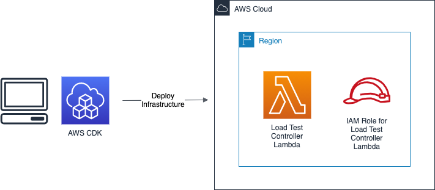
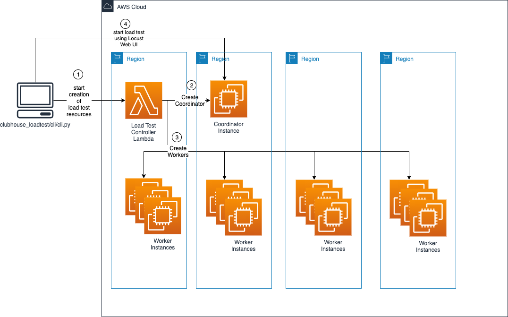

# aws-virtual-waiting-room-loadtest

temporary home for the load testing framework used to develop, and shipped with the aws-virtual-waiting room solution.

## Setup instructions

### OSx

#### Prerequisites

- [Homebrew is installed](https://brew.sh)
  
  `/bin/bash -c "$(curl -fsSL https://raw.githubusercontent.com/Homebrew/install/HEAD/install.sh)"`

- [NVM is installed](https://tecadmin.net/install-nvm-macos-with-homebrew/)

  `brew inastall nvm`

- [Nodejs is installed](https://tecadmin.net/install-nvm-macos-with-homebrew/)

  `nvm install node`

- [AWS CLI is installed](https://docs.aws.amazon.com/cli/latest/userguide/install-cliv2-mac.html)

- [CDK is installed](https://docs.aws.amazon.com/cdk/latest/guide/work-with.html#work-with-prerequisites)

  `npm install -g aws-cdk`

- [Python is installed](https://docs.python-guide.org/starting/install3/osx/#doing-it-right)
  
    `brew install python`
  

- [Virtualenv is installed](https://docs.python-guide.org/dev/virtualenvs/#lower-level-virtualenv)
  
    `pip install virtualenv`

#### Clone repository

`git clone git@ssh.gitlab.aws.dev:ammoheim/aws-virtual-waiting-room-loadtest.git`

#### Create Virtual Environment

`cd aws-virtual-waiting-room-loadtest/`

`virtualenv venv`

#### Install Python Dependencies (using virtual environment created in previous step)

`source venv/bin/activate`

`pip install -r requirements.txt`

## Running a Test

### Locally
you can run the load tests directly from your machine:

    locust -f tests/test_signup_spike.py

open a browser to the address where the test is running and use port 8089 (eg: http://localhost:8089)

Running locally is recommended for test development, since it is easier to debug issues with the test.

Once a test runs as expected, it is possible to run the same test in scale in a distributed manner.

### Distributed

Running the load tests distributed requires the load testing infrastructure to be deployed.

##### Deploying the Infrastructure (for deploying infrastructure)
(from the `infrastructure/` folder)
1. `cdk deploy` (input `y` at the prompt)

##### Using the CLI to spin up a load test

Once the load testing infrastructure is deployed, it can be used to spin up load tests.

**steps**
1. `cd aws-virtual-waiting-room-loadtest/cli`
2. `./cli.py`
3. follow the prompts
4. open the coordinator url (http://<< coordinator ip >>:8089), this will automatically be opened for you on MacOS.

**recommended settings for larger scale tests**

coordinator instance type: t3.xlarge

worker instance type: t3.medium

worker processes per instance: 2 (1 per vCPU)

**NOTE**: the coordinator node must be deployed into a region with a configured security group

**NOTE**: it takes a couple of minutes for the coordinator instance to come up. Refresh the opened browser window to see
the locust Web UI (approximately 5 minutes)

Once a test has been created, it is possible to add additional workers. Use the add workers option and supply the 
coordinator IP address.

It is possible to use multiple accounts to run large scale load tests. Simply re-run the setup on a different account
and use a seperate terminal window (with separate  AWS credentials) to control the workers in the other account.

## Additional Reading

[Locust Docs](https://docs.locust.io/en/stable/)
